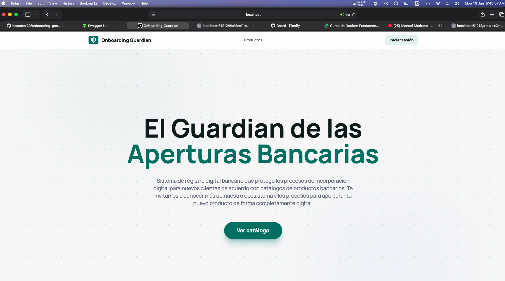
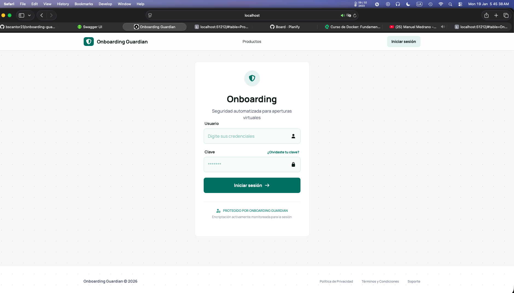
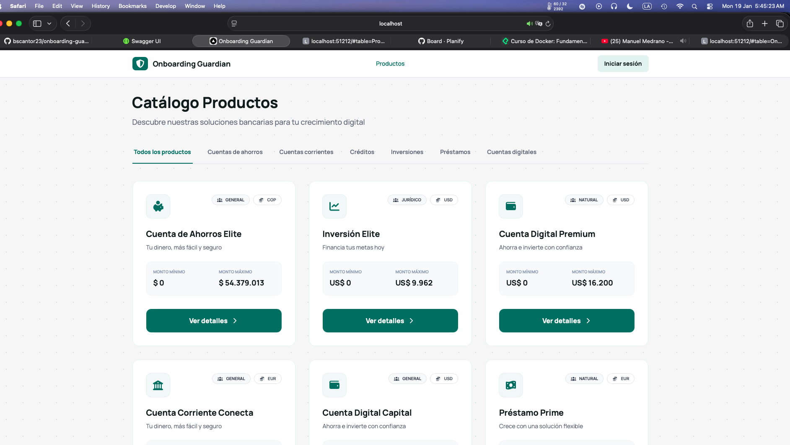
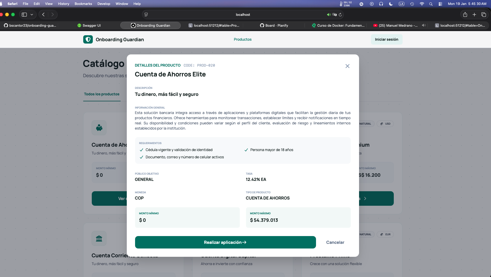
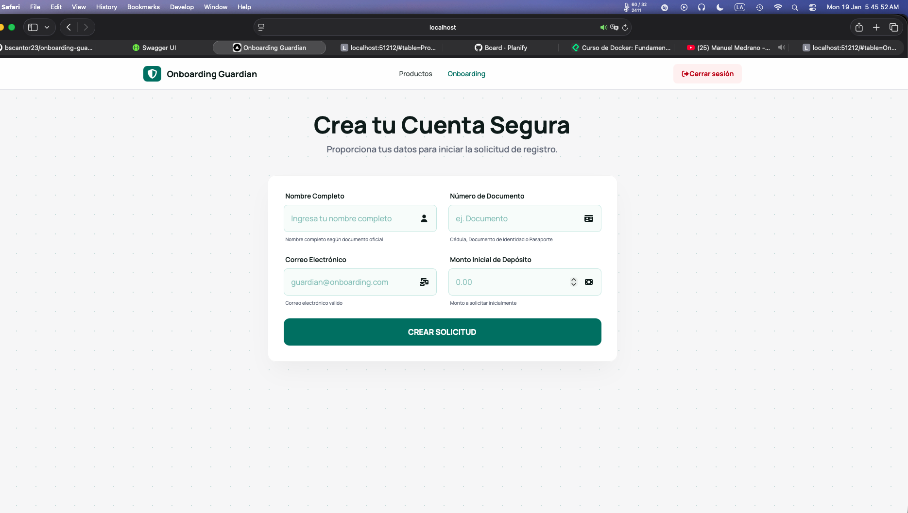
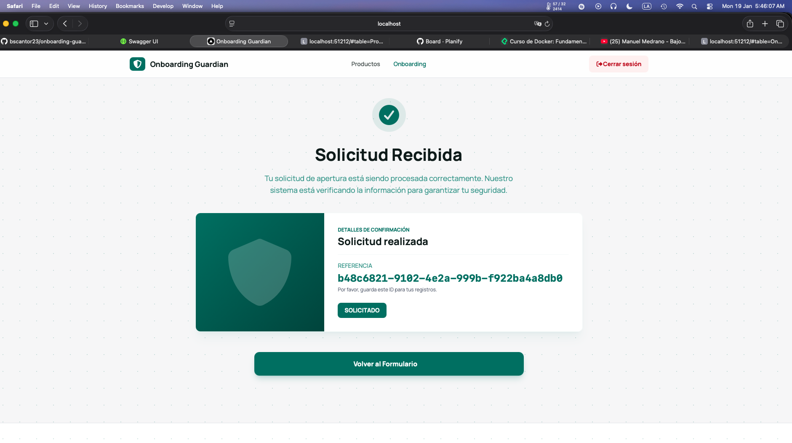
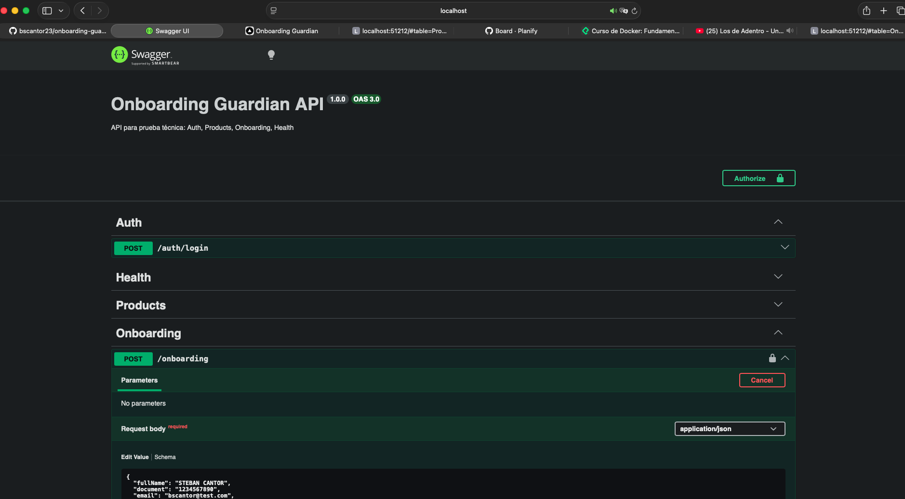

# Onboarding Guardian



## Prueba Técnica – Backend

Bienvenido al repositorio **Onboarding Guardian**, una solución desarrollada como parte de la prueba técnica de backend titulada:

> **Aventura: El Guardián del Onboarding**

---

## Contexto

En esta misión, serás el Guardián del Onboarding, responsable de proteger el flujo de registro de nuevos clientes para el banco digital. Tu objetivo es crear microservicios sólidos, validados y seguros que reciba solicitudes de
apertura de cuenta y simule su almacenamiento.

---

## Reto Principal

La solución implementa una **API en NestJS** que cumple con las siguientes misiones:

### 1. Auth




**POST `/auth/login`**

* Recibe credenciales ficticias (usuario y contraseña).
* Retorna un **JWT válido por 5 minutos**.
* El token se utiliza para proteger los endpoints sensibles del sistema.

---

### 2. Products

**GET `/products`**




* Retorna un listado de productos disponibles.

**GET `/products/:id`**



* Retorna el detalle de un producto específico.
* Si el producto no existe, responde con el **código HTTP correspondiente**.

---

### 3. Onboarding

**POST `/onboarding`**




* Requiere autenticación mediante **JWT (Bearer Token)**.

* Recibe los siguientes datos:

  * Nombre
  * Documento
  * Email
  * Monto inicial

* Valida la información usando **class-validator**.

* Guarda los datos con estado inicial: **`REQUESTED`**.

* Devuelve la siguiente respuesta:

```json
{
  "onboardingId": "<uuid>",
  "status": "REQUESTED"
}
```

---

### 4. Health

**GET `/health`**

* Endpoint de verificación de estado del servicio.
* Responde:

```json
{
  "ok": true
}
```

---

## Plus Implementados

* **Frontend con Next.js** integrado para consumir la API y simular la experiencia de usuario.
* **Manejo de caché con Redis** para optimizar consultas (ej. productos).
* **Orquestación con Docker Compose** para levantar infraestructura y servicios de forma unificada.
* **Documentación con Swagger** para exploración y prueba de endpoints.

---

## Tecnologías Utilizadas

### Backend

* **NestJS** – Framework principal para la API.
* **Prisma ORM** – Manejo de base de datos, migraciones y seeder.
* **PostgreSQL** – Base de datos relacional.
* **JWT (Passport + @nestjs/jwt)** – Autenticación y autorización.
* **class-validator / class-transformer** – Validación y transformación de DTOs.
* **Swagger** – Documentación interactiva de la API.
* **Jest** – Cobertura de pruebas unitarias del 100% con implementación de specs de Nest.
* **Supertest** – Pruebas end to end del sistema.
* **Redis** – Implementación pequeña de caché en el catálogo de Productos.

### Frontend

* **Next.js** – Interfaz visual para consumir la API.

### Infraestructura

* **Docker & Docker Compose** – Contenerización y orquestación de servicios.
* **Yarn Workspaces (Monorepo)** – Gestión de dependencias y ejecución centralizada.

---

## Estructura del Proyecto (Monorepo)

```
onboarding-guardian/
├── apps/
│   ├── api/        # Backend NestJS
│   └── web/        # Frontend Next.js
├── docker-compose.yml
├── package.json   # Root (Yarn Workspaces + scripts)
└── README.md
```

---

## Cómo Ejecutar el Proyecto

### 1. Requisitos

* **Docker**
* **Docker Compose**
* **Yarn** (v1.x recomendado)

---

### 2. Levantar Todo el Entorno

Desde la raíz del monorepo (`onboarding-guardian`), ejecuta:

```bash
yarn dev:all
```

Este comando realiza automáticamente:

1. Levanta la infraestructura (PostgreSQL y Redis).
2. Inicia el servicio de la API.
3. Ejecuta migraciones de base de datos.
4. Resetea y siembra datos de prueba.
5. Levanta la API y el Frontend.
6. Muestra los logs en tiempo real de ambos servicios.

---

## Visualizar la Base de Datos (Prisma Studio)

Para inspeccionar los registros almacenados en la base de datos mediante una interfaz gráfica:

```bash
yarn workspace api run prisma:studio
```

Esto abrirá **Prisma Studio** en tu navegador, permitiéndote ver y modificar los datos de manera visual.

---

## Documentación API

Una vez la API esté corriendo, puedes acceder a Swagger en:

```
http://localhost:3001/docs
```



Desde allí puedes:

* Autenticarte con JWT usando el botón **Authorize**.
* Probar todos los endpoints disponibles.

---

## Futuras Implementaciones

Debido al tiempo, a criterio personal me hubiera gustado finalizar la implementación con CI/CD utilizando Github Actions y montarlo en una instancia real de AWS con un dominio propio. Queda como pendiente como logro personal para revisarlo.

Adicionalmente, aunque la prueba no lo mencione, sería prudente tener también una ruta para listar todos los onboardings, poder actualizar su estado y que estos relacionen un producto dentro de su solicitud. No fue desarrollado en su momento dados los criterios de la prueba.

---

**Autor:** Steban Cantor
**Repositorio:** Público en GitHub (entrega de prueba técnica)
